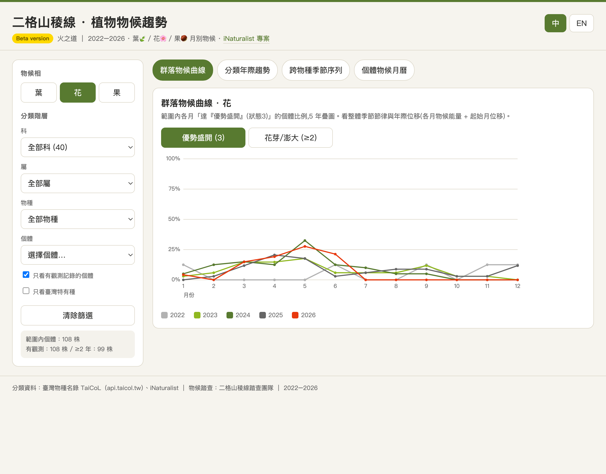
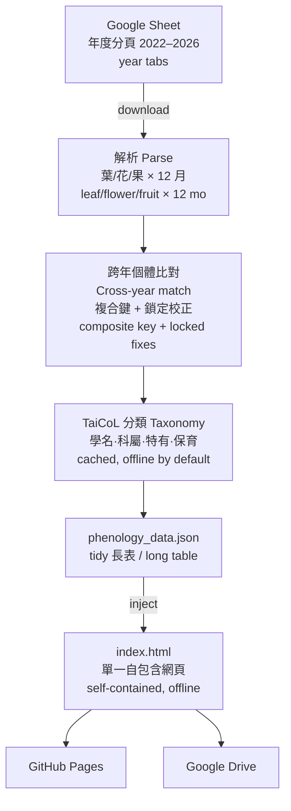

# 二格山稜線 · 植物物候趨勢 ｜ Mt. Erge Ridge · Plant Phenology

火之道（Way of Fire）稜線步道 2022–2026 植物物候踏查的互動視覺化。
An interactive visualization of plant phenology along the "Way of Fire" ridge trail of Mt. Erge (二格山), Taiwan, 2022–2026.

🔗 **Live**: https://bunnytailgra22.github.io/erge-phenology/ ·
🪲 **iNaturalist 專案 / project**: https://www.inaturalist.org/projects/erge-mountain-trail · **Beta**

[English](#english) ｜ [繁體中文](#繁體中文)

---

## Architecture / 專案架構

Data scale: ~194 tagged individuals · 5 years · ~134 species · ~60 families · 25 Taiwan endemics.

---

## English

### Overview
A community survey records the seasonal rhythm — **leaf 🍃 / flower 🌸 / fruit 🌰** — of tagged plants along one ridge trail. This site turns five years of those records into an interactive dashboard for reading seasonal patterns and year-to-year shifts.

### Data model
- One **sheet tab per survey year**; one **row per tagged individual**; columns hold the monthly phenophase state.
- Three phenophases, each scored **1 / 2 / 3** for all 12 months (e.g. flower: 1 = none/ended, 2 = bud/swelling, 3 = full bloom).
- Normalized into a tidy model: one value per **(individual, year, month, phenophase)**.

### Cross-year identity — the core challenge
Tag numbers (編號) are unstable between years (blank, duplicated, re-numbered). Individuals are linked across years by a **composite key** — normalized species name + growth form + trail side + walking order — anchored on the most recent year as the registry. Auto-match covers ~95%; a small set of **surveyor-confirmed manual links is locked in** (e.g. notes mentioning re-tagging or a replaced plant).

### Taxonomy
Names are resolved against the **Catalogue of Life in Taiwan (TaiCoL)** — Taiwan-accepted scientific name, family & genus (Chinese + Latin), endemism, and IUCN / national Red List status; **iNaturalist** is the fallback. The dataset carries 25 Taiwan endemics and conservation flags including one Critically Endangered species.

### Dashboard — four views
1. **Community curve** — share of individuals reaching a phenophase each month, 5 years overlaid.
2. **Taxon yearly trend** — active span & peak per year; roll up species → genus → family.
3. **Cross-species sequence** — individuals ordered by onset month (the seasonal relay).
4. **Individual calendar** — month × year grid per plant, with taxonomy & conservation badges.

Bilingual **中 / EN** toggle (EN shows scientific names + Latin family/genus). Single self-contained HTML — data embedded, **works offline, no backend**.

### Pipeline & updates
`Sheet → parse → cross-year match → TaiCoL taxonomy (cached) → phenology_data.json → injected into the HTML → GitHub Pages`. After each survey update the maintainer re-runs this chain (one command) and redeploys; the taxonomy cache means it normally runs offline in seconds.

### Tech
Vanilla HTML / CSS / JS, hand-rolled SVG charts, no runtime dependencies. Brand palette from the 二格山 visual identity (荒野綠 / 黃 / 紅).

### Data sources & credits
- **Phenology survey**: 二格山稜線踏查團隊 (Mt. Erge Ridge survey team), 2022–2026
- **Taxonomy**: Catalogue of Life in Taiwan — TaiCoL (api.taicol.tw); iNaturalist
- **iNaturalist project**: https://www.inaturalist.org/projects/erge-mountain-trail

### Status & license
**Beta.** Data © the survey team. For reuse, attribution is requested (e.g. CC BY-NC 4.0); please contact the team.

---

## 繁體中文

### 簡介
社群踏查記錄一條稜線步道上掛牌植物的季節節律 —— **葉 🍃 / 花 🌸 / 果 🌰**。本站把五年的記錄整理成互動式儀表板,用來閱讀季節型態與年際變化。

### 資料模型
- **每個踏查年一個分頁**;**每列一株掛牌個體**;欄位記錄各月的物候狀態。
- 三個物候相,每相 12 個月各記 **1 / 2 / 3**(例:花 — 1 無花/終花、2 花芽/澎大、3 優勢盛開)。
- 正規化為長表:每筆 = **(個體, 年, 月, 物候相) = 狀態值**。

### 跨年個體辨識 —— 核心挑戰
編號跨年不穩定(空白、重複、重新編號)。以**複合鍵**(正規化物種名 + 形相 + 步道左右 + 踏查順序)跨年比對,並以最新年度為主檔。自動命中約 95%,少數**經踏查者確認的對應已鎖定**(如備註提到換牌或植株替換者)。

### 分類
以 **臺灣物種名錄(TaiCoL)** 解析:臺灣接受學名、科與屬(中文 + 拉丁)、特有性、IUCN / 國家紅皮書狀態;**iNaturalist** 為後備。資料含 25 種臺灣特有種,以及保育標記(含 1 種極危 CR)。

### 儀表板 —— 四個視圖
1. **群落物候曲線** —— 各月達某物候相的個體比例,5 年疊圖。
2. **分類年際趨勢** —— 各年活躍區間與盛期;可由物種上捲到屬、科。
3. **跨物種季節序列** —— 個體依起始月排序的季節接力。
4. **個體物候月曆** —— 每株的 月 × 年 格圖,附分類與保育徽章。

提供 **中 / EN** 雙語切換(英文模式顯示學名與拉丁科屬)。單一自包含 HTML —— 資料內嵌、**可離線、無需後端**。

### 管線與更新
`Sheet → 解析 → 跨年比對 → TaiCoL 分類(快取)→ phenology_data.json → 注入 HTML → GitHub Pages`。每次踏查更新後,維護者一鍵重跑此鏈並重新部署;因有分類快取,平時離線數秒內完成。

### 技術
純 HTML / CSS / JS、手刻 SVG 圖表,無執行時相依。配色取自二格山視覺識別(荒野綠 / 黃 / 紅)。

### 資料來源與致謝
- **物候踏查**:二格山稜線踏查團隊,2022–2026
- **分類**:臺灣物種名錄 TaiCoL(api.taicol.tw)、iNaturalist
- **iNaturalist 專案**:https://www.inaturalist.org/projects/erge-mountain-trail

### 狀態與授權
**Beta 版。** 資料著作權屬踏查團隊。如需引用,請標註出處(例如 CC BY-NC 4.0),並與團隊聯繫。
